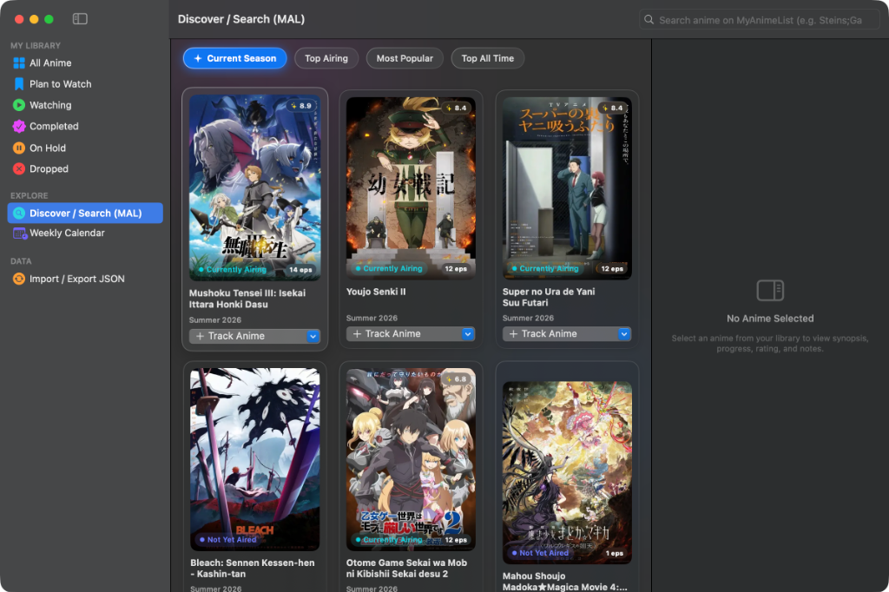
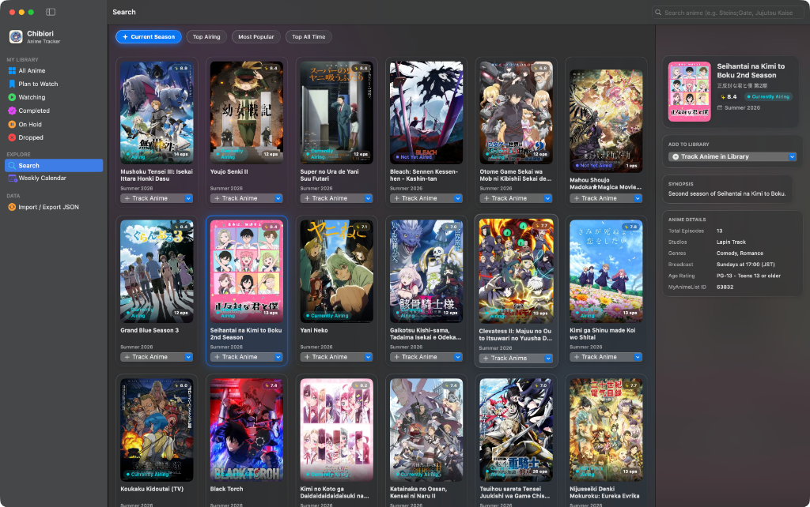
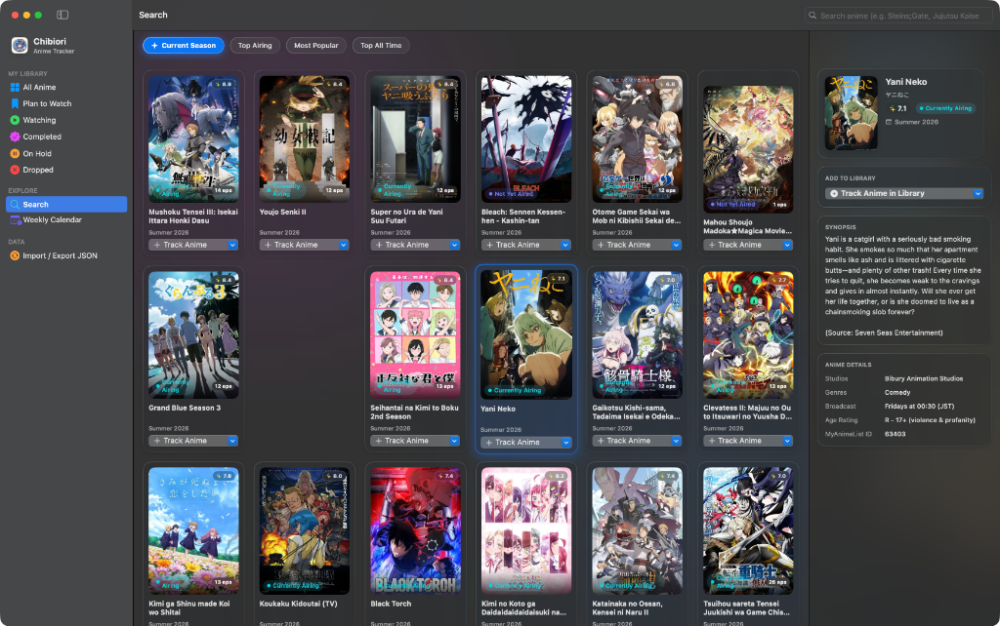
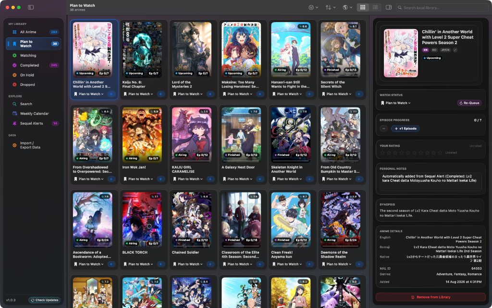
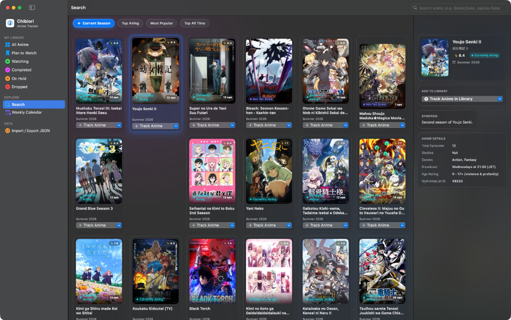

<div align="center">

  

  # Chibiori (千織)

  **The Native, Offline-First Anime Tracker & Schedule Manager for macOS**

  [](https://developer.apple.com/swift/)
  [-lightgrey.svg?style=flat-square)](https://www.apple.com/macos/)
  [](https://www.apple.com/mac/)
  [](LICENSE)
  [](https://github.com/Ghostkwebb/Chibiori/releases/latest)

  <p>
    <b>Chibiori</b> is a lightweight, high-performance desktop anime manager designed natively for macOS.
    <br>
    Built with <b>SwiftUI</b>, <b>SwiftData</b>, and <b>CoreAnimation</b> for fluid 120Hz ProMotion scrolling, zero cloud lock-in, and instant offline access.
  </p>

  <a href="https://github.com/Ghostkwebb/Chibiori/releases/latest/download/Chibiori.dmg">
    
  </a>

</div>

<br />

<div align="center">
  
</div>

<br />

> [!IMPORTANT]
> **System Requirements**: Requires a Mac running **macOS 14.0 (Sonoma)** or newer. Chibiori is a native universal binary supporting both **Apple Silicon (M1/M2/M3/M4)** and **Intel** Macs.

---

## Key Features

### 1. Fluid Poster Grid & Dynamic Inspector
Browse your collection with smooth 120Hz scrolling, adjustable poster sizing, and an interactive Inspector sidebar that presents high-resolution artwork, synopses, genres, custom notes, and score badges.

<div align="center">
  
</div>

<br />

### 2. Sequel & Season 2 Alerts
Never miss an upcoming release. Chibiori scans your completed anime list in high-speed parallel batches (~1.5s) to detect newly announced seasons, movies, or spin-offs, allowing you to add them to your Plan to Watch list with one click.

<div align="center">
  
</div>

<br />

### 3. Weekly Airing Calendar
Stay up-to-date with currently airing simulcasts. The calendar organizes weekly broadcasts by day, showing countdown timers, episode numbers, and airing status pills.

<div align="center">
  
</div>

<br />

### 4. High-Density Compact Table View
For large anime libraries, the compact table mode provides immediate access to watch status pickers, episode counters, MAL scores, and sorting options.

<div align="center">
  
</div>

<br />

### 5. Global Search & Online Discovery
Search millions of anime titles across MyAnimeList and AniList with instant debounced queries, rich metadata previews, and seamless library additions.

<div align="center">
  
</div>

---

## Highlights

*   **Fluid Glassmorphic UI**: Detached floating sidebar, specular glass borders, vibrant status pills, and adaptive dark mode tailored for macOS.
*   **120Hz ProMotion Performance**: Multi-threaded CoreAnimation compositor rendering (`drawsAsynchronously`), zero-allocation viewport reuse, and instant keyboard grid navigation.
*   **Multilingual Title Preferences**: Switch seamlessly between English, Romaji, and Native Japanese/Chinese titles across your entire collection, with custom title overrides for any anime.
*   **Automatic Airing Status Sync**: Automatically checks your active and upcoming watchlist in lightweight background sweeps, updating airing badges and final episode counts when series finish broadcasting.
*   **Offline-First SwiftData Engine**: All watch status records, personal ratings, custom notes, and poster artwork are saved locally on disk with zero telemetry or account requirements.
*   **Private iCloud Sync & Backup Vault**: Automatic background syncing to personal iCloud Drive containers (`Chibiori_AutoVault.json`), universal JSON backup exports, and full MAL XML file imports.
*   **In-App Auto-Updates**: One-click check for updates powered directly by GitHub Releases.

---

## Installation

1.  **Download**: Get the latest `Chibiori.dmg` from the [Releases Page](https://github.com/Ghostkwebb/Chibiori/releases/latest).
2.  **Mount**: Double-click `Chibiori.dmg` to open the disk image.
3.  **Install**: Drag `Chibiori.app` into your **`/Applications`** folder.
4.  **Open**: Launch the app from Spotlight or Applications.

---

## Keyboard Shortcuts

| Shortcut | Action |
| :--- | :--- |
| `↑` `↓` `←` `→` | Navigate anime cards in Poster Grid & Sequel Alerts |
| `Return` / `Enter` | Select anime and open Inspector |
| `Space` | Increment current episode progress (+1) |
| `⌘` + `Backspace` | Re-queue anime to top of Plan to Watch |
| `⌘` + `1` | Switch to Poster Grid view |
| `⌘` + `2` | Switch to Compact Table view |
| `⌘` + `⌥` + `I` | Toggle Inspector panel |
| `⌘` + `⇧` + `F` | Jump to Discover / Search tab |
| `⌘` + `⇧` + `K` | Jump to Weekly Airing Calendar |

---

## Tech Stack

*   **Language**: Swift 5.10 / Swift 6.0
*   **UI Framework**: SwiftUI (macOS 14+ SDK) & AppKit Window Management
*   **Data Persistence**: SwiftData (`@Model`, `ModelContainer`, `ModelContext`)
*   **Image Pipeline**: CoreGraphics hardware thumbnail decoding and disk caching
*   **Network & APIs**:
    *   AniList GraphQL API (Batch Hydration & Sequel Discovery)
    *   Jikan REST API v4 (MyAnimeList Gateway & Weekly Schedules)
*   **Cloud Storage**: Apple CloudKit & Private iCloud Drive Documents

---

## Building from Source

### Prerequisites
*   macOS 14.0 (Sonoma) or newer
*   Xcode 15.0+ or Xcode Command Line Tools (`xcode-select --install`)

### Compile and Package `.app` Bundle
```bash
git clone https://github.com/Ghostkwebb/Chibiori.git
cd Chibiori
./scripts/build_app.sh
```
The compiled, signed application bundle will be created at `./Chibiori.app`.

### Run Automated Smoke Test Suite
```bash
DEVELOPER_DIR=/Applications/Xcode.app/Contents/Developer swift run Chibiori --smoke-test
```

---

## Credits

*   **AniList API**: Community anime metadata, cover art, and relationship graph.
*   **Jikan API**: Open-source REST API for MyAnimeList data.
*   **Apple SF Symbols**: System iconography and UI glyphs.

---

<div align="center">
  <p>Crafted natively for macOS</p>
</div>
